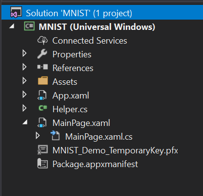
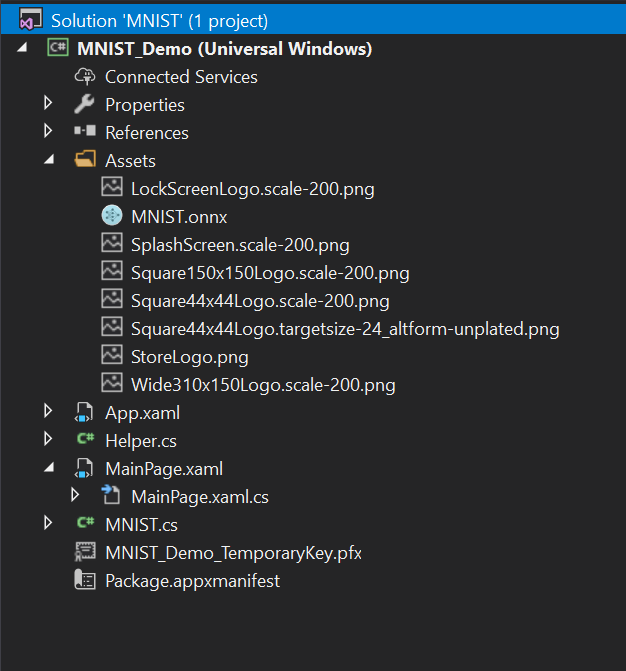

# Get started with Windows ML (UWP app)

In this tutorial, we'll build a simple UWP app that uses a trained machine learning model to recognize a numeric digit drawn by the user. This tutorial primarily focuses on how to load and use Windows ML in your UWP app.

## Prerequisites

- [Windows 10 SDK](https://www.microsoft.com/en-us/software-download/windowsinsiderpreviewSDK) (Build 17723 or higher)
- [Visual Studio](https://developer.microsoft.com/windows/downloads)

## 1. Download the sample

First, you'll need to download our [MNIST Tutorial](https://github.com/Microsoft/Windows-Machine-Learning/tree/RS5/Samples/MNIST/Tutorial/cs) from GitHub. We've provided a template with implemented XAML controls and events, including:

- An [InkCanvas](https://docs.microsoft.com/uwp/api/windows.ui.xaml.controls.inkcanvas) to draw the digit.
- [Buttons](https://docs.microsoft.com/uwp/api/windows.ui.xaml.controls.button) to interpret the digit and clear the canvas.
- Helper routines to convert the InkCanvas output to a [VideoFrame](https://docs.microsoft.com/uwp/api/windows.media.videoframe).

A completed MNIST sample is also available to download from GitHub.

## 2. Open project in Visual Studio Preview

Launch Visual Studio Preview, and open the MNIST sample application. (If the solution is shown as unavailable, you'll need to right-click and select "Reload Project.")

Inside the solution explorer, the project has three main code files:

- `MainPage.xaml` - All of our XAML code to create the UI for the InkCanvas, buttons, and labels.
- `MainPage.xaml.cs` - Where our application code lives.
- `Helper.cs` - Helper routines to crop and convert image formats.



## 3. Build and run project

In the Visual Studio toolbar, change the Solution Platform to "x64" to run the project on your local machine.

To run the project, click the **Start Debugging** button on the toolbar, or press F5. The application should show an InkCanvas where users can write a digit, a "Recognize" button to interpret the number, an empty label field where the interpreted digit will be displayed as text, and a "Clear Digit" button to clear the InkCanvas.


**Note**: If you downloaded a Build higher than 17228, then you might need to change the project's deployment target version. Under the project solution, go to **Properties**. In the Application tab, set the target version to match your OS and SDK.

## 4. Download a model

Next, let's get a machine learning model to add to our app. For this tutorial, we'll use a pre-trained **MNIST model** that was trained with the [Microsoft Cognitive Toolkit (CNTK)](https://docs.microsoft.com/cognitive-toolkit/) and [exported to ONNX format](https://github.com/onnx/tutorials/blob/master/tutorials/CntkOnnxExport.ipynb).

If you are using the MNIST Tutorial sample from GitHub, the MNIST model has already been included in your Assets folder, and you will need to add it to your application as an existing item. You can also download the pre-trained model from the [ONNX Model Zoo](https://github.com/onnx/models) on GitHub.

## 5. Add the model

After downloading the MNIST model, right click on the Assets folder in the Solution Explorer, and select "**Add** > **Existing Item**". Point the file picker to the location of your ONNX model, and click add.

The project should now have two new files:

- `MNIST.onnx` - your trained model.
- `MNIST.cs` - the Windows ML generated code.



To make sure the model builds when we compile our application, right click on the `mnist.onnx` file, and select **Properties**. For **Build Action**, select **Content**.

Now, let's take a look at the newly generated code in the `MNIST.cs` file. We have three classes:

- **MNISTModel** creates the machine learning model representation, creates a sessions on the system default device, binds the specific inputs and outputs to model, and evaluates the model asynchronously. 
- **MNISTInput** initializes the input types that the model expects. In this case, the input expects a VideoFrame.
- **MNISTOutput** initializes the types that the model will output. In this case, the output will be a list called "classLabel" of type `<long>` and a Dictionary called "prediction" of type `<long, float>`

We'll now use these classes to load, bind, and evaluate the model in our project.

## 6. Load, bind, and evaluate the model

For Windows ML applications, the pattern we want to follow is: Load > Bind > Evaluate.

- Load the machine learning model.
- Bind inputs and outputs to the model.
- Evaluate the model and view results.

We'll use the interface code generated in `MNIST.cs` to load, bind, and evaluate the model in our app.

First, in `MainPage.xaml.cs`, let's instantiate the model, inputs, and outputs.

```csharp
namespace MNIST_Demo
{
	public sealed partial class MainPage : Page
	{
	    private MNISTModel ModelGen = new MNISTModel();
	    private MNISTInput ModelInput = new MNISTInput();
	    private MNISTOutput ModelOutput = new MNISTOutput();
	    ...
	}
}
```

Then, in LoadModel(), we'll load the model. The MNISTModel class represents the MNIST model and creates the session on the system default device. To load the model, we call the CreateMNISTModel method, passing in the ONNX file as the parameter.

```csharp
private async void LoadModel()
{
     //Load a machine learning model
     StorageFile modelFile = await StorageFile.GetFileFromApplicationUriAsync(new Uri($"ms-appx:///Assets/model.onnx"));
     modelGen = await modelModel.CreateFromFilePathAsync(modelFile.Path);
}
```

Next, we want to bind our inputs and outputs to the model. The generated code also includes Input and Output wrapper classes. The Input class represents the model's expected inputs, and the Output class represents the model's expected outputs.

To initialize the model's input object, call the Input class constructor, passing in your application data, and make sure that your input data matches the input type that your model expects. The MNISTModelInput class expects a VideoFrame, so we use a helper method to get a VideoFrame for the input.

Using our included helper functions in `helper.cs`, we will copy the contents of the InkCanvas, convert it to type VideoFrame, and bind it to our model.

```csharp
private async void recognizeButton_Click(object sender, RoutedEventArgs e)
{
     //Bind model input with contents from InkCanvas
     VideoFrame vf = await helper.GetHandWrittenImage(inkGrid);
     modelInput.Input3 = ImageFeatureValue.CreateFromVideoFrame(vf);
}
```

For output, we simply call Evaluate() with the specified input. Once your inputs are initialized, call the model's Evaluate method to evaluate your model on the input data. Evaluate binds your inputs and outputs to the model object and evaluates the model on the inputs.

Since the model returns an output Tensor, we'll first want to convert it to a friendly datatype, and then parse the returned list to determine which digit had the highest probability and display that one.

```csharp
private async void recognizeButton_Click(object sender, RoutedEventArgs e)
{
    //Bind model input with contents from InkCanvas
    VideoFrame vf = await helper.GetHandWrittenImage(inkGrid);
    modelInput.Input3 = ImageFeatureValue.CreateFromVideoFrame(vf);
            
    //Evaluate the model
    modelOutput = await modelGen.Evaluate(modelInput);

    //Convert output to datatype
    IReadOnlyList<float> VectorImage = modelOutput.Plus214_Output_0.GetAsVectorView();
    IList<float> ImageList = VectorImage.ToList();

    //Query to check for highest probability digit
    var maxIndex = ImageList.IndexOf(ImageList.Max());

    //Display the results
    numberLabel.Text = maxIndex.ToString();
}
```

Finally, we'll want to clear out the InkCanvas to allow users to draw another number.

```csharp
private void clearButton_Click(object sender, RoutedEventArgs e)
{
    inkCanvas.InkPresenter.StrokeContainer.Clear();
    numberLabel.Text = "";
}
```

## 7. Launch the app

Once we build and launch the app, we'll be able to recognize a number drawn on the InkCanvas.


That's it - you've made your first Windows ML app! For more samples that demonstrate how to use Windows ML, check out our [Windows-Machine-Learning](https://github.com/Microsoft/Windows-Machine-Learning) repo on GitHub.
